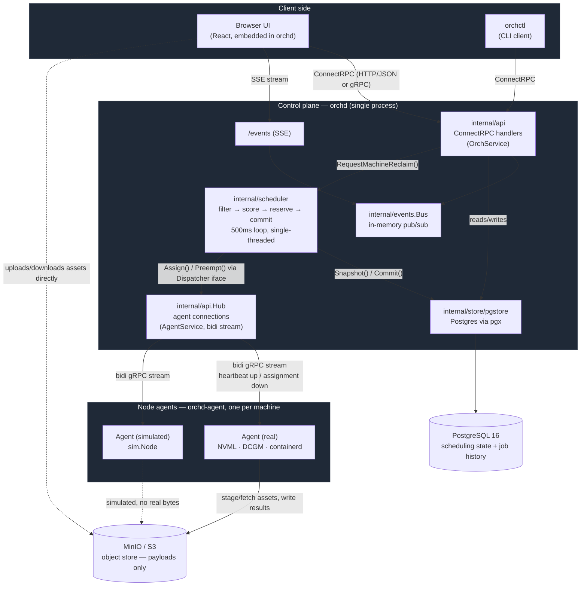

# orch — GPU compute-sharing orchestrator

A fleet of GPU workstations owned by different teams sits idle most of the time. Teams want
guaranteed access to their own machines; the organization wants those machines busy.

This reconciles both: teams get **guaranteed capacity** in a named pool, idle capacity is **lent**
to other pools automatically, and lent capacity is **reclaimed** on demand by preempting borrowers.
Borrowed work degrades; owned work never waits.

The system is workload-agnostic. It schedules containers against GPU slots. It knows nothing about
rendering, LLMs, or CAD.

---

# System Architecture

---
